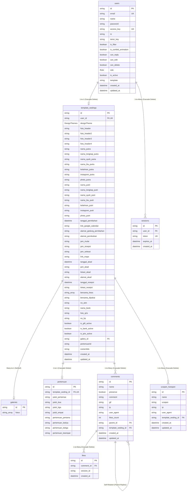

# 🏛️ Arsitektur Basis Data (Database Architecture)
**Aplikasi Undangan Pernikahan Digital Multi-Template**

Dokumen ini mendokumentasikan spesifikasi teknis arsitektur basis data, rincian tabel, relasi, indeks, tipe data, serta jumlah kolom fisik yang terdefinisi pada skema database PostgreSQL melalui Prisma ORM (`prisma/schema.prisma`).

---

## 📊 1. Ringkasan Eksekutif (Database Summary)

| Metrik | Jumlah | Keterangan |
| :--- | :---: | :--- |
| **Total Tabel / Model** | **8** | `users`, `template_wedings`, `ucapan_harapan`, `pertemuan`, `galeries`, `comments`, `likes`, `sessions` |
| **Total Kolom Fisik di Database** | **107** | Kolom nyata yang tersimpan di engine PostgreSQL |
| **Total Relasi Virtual Prisma** | **16** | Field navigasi ORM (Foreign Relation Accessors) |
| **Total Enums** | **2** | `Role` (ADMIN, DEV), `DesignThemes` (CLASSIC, MODERN, ELEGANT, MINIMALIST) |

### Rincian Jumlah Kolom Per Tabel

| No | Nama Model Prisma | Nama Tabel Database (`@@map`) | Jumlah Kolom Fisik | Relasi Prisma | Fungsi Utama |
| :---: | :--- | :--- | :---: | :---: | :--- |
| 1 | `User` | `users` | **17** | 2 | Akun admin/mempelai, preferensi tema, status & hak akses |
| 2 | `TemplateWeding` | `template_wedings` | **49** | 5 | Data utama undangan (mempelai, jadwal, lokasi, hadiah, foto) |
| 3 | `UcapanHarapan` | `ucapan_harapan` | **8** | 1 | Buku harapan khusus pohon ucapan (Template B & C) |
| 4 | `Pertemuan` | `pertemuan` | **10** | 1 | Cerita perjalanan cinta (Love Story) 4 babak |
| 5 | `Galery` | `galeries` | **2** | 1 | Koleksi array URL foto album pernikahan |
| 6 | `Comment` | `comments` | **12** | 4 | Buku tamu, ucapan doa, & reservasi kehadiran (RSVP) |
| 7 | `Like` | `likes` | **4** | 1 | Log penyuka (like) komentar berdasarkan session ID |
| 8 | `Session` | `sessions` | **5** | 1 | Manajemen autentikasi sesi user |
| **Total** | | | **107** | **16** | |

---

## 🗺️ 2. Diagram Relasi Entitas (Entity-Relationship Diagram)



---

## 📑 3. Spesifikasi Kolom dan Struktur Tabel

### 1. Tabel `users` (Model: `User`) — 17 Kolom
Tabel utama untuk akun pengantin/administrator.

| No | Nama Kolom DB | Nama Field Prisma | Tipe Data | Nullable | Default | Keterangan & Constraint |
| :---: | :--- | :--- | :--- | :---: | :--- | :--- |
| 1 | `id` | `id` | `String` (UUID) | ❌ | `uuid()` | Primary Key |
| 2 | `email` | `email` | `String` | ❌ | - | Unique Key (kredensial login) |
| 3 | `name` | `name` | `String` | ❌ | - | Nama lengkap / username |
| 4 | `password` | `password` | `String` | ❌ | - | Hash sandi bcrypt |
| 5 | `access_key` | `accessKey` | `String` | ❌ | - | Unique Key kode akses API/Undangan |
| 6 | `tz` | `tz` | `String` | ❌ | `'Asia/Jakarta'` | Zona waktu acara (WIB/WITA/WIT) |
| 7 | `tenor_key` | `tenorKey` | `String` | ✅ | `null` | API Key Tenor untuk fitur GIF |
| 8 | `is_filter` | `isFilter` | `Boolean` | ❌ | `true` | Filter kata kotor pada ucapan |
| 9 | `is_confetti_animation`| `isConfettiAnimation` | `Boolean` | ❌ | `true` | Efek confetti saat buka undangan |
| 10 | `can_reply` | `canReply` | `Boolean` | ❌ | `true` | Izinkan balasan komentar |
| 11 | `can_edit` | `canEdit` | `Boolean` | ❌ | `true` | Hak akses edit ucapan |
| 12 | `can_delete` | `canDelete` | `Boolean` | ❌ | `true` | Hak akses hapus ucapan |
| 13 | `role` | `role` | `Role` (Enum) | ❌ | `ADMIN` | Role akun (`ADMIN`, `DEV`) |
| 14 | `is_active` | `isActive` | `Boolean` | ❌ | `true` | Status aktif akun |
| 15 | `template` | `template` | `String` | ❌ | `'A'` | Pilihan tema aktif (`'A'`, `'B'`, `'C'`) |
| 16 | `created_at` | `createdAt` | `DateTime` | ❌ | `now()` | Timestamp pembuatan |
| 17 | `updated_at` | `updatedAt` | `DateTime` | ❌ | auto update | Timestamp modifikasi terakhir |

---

### 2. Tabel `template_wedings` (Model: `TemplateWeding`) — 49 Kolom
Tabel inti yang menampung seluruh konfigurasi dan konten undangan pengantin.

| No | Nama Kolom DB | Nama Field Prisma | Tipe Data | Nullable | Default | Keterangan & Constraint |
| :---: | :--- | :--- | :--- | :---: | :--- | :--- |
| 1 | `id` | `id` | `String` (CUID) | ❌ | `cuid()` | Primary Key |
| 2 | `user_id` | `userId` | `String` (UUID) | ❌ | - | Foreign Key ke `users(id)`, Unique, OnDelete: Cascade |
| 3 | `designTheme` | `designTheme` | `DesignThemes` | ❌ | `CLASSIC` | Enum: `CLASSIC`, `MODERN`, `ELEGANT`, `MINIMALIST` |
| 4 | `foto_header` | `fotoHeader` | `String` | ✅ | `null` | URL foto cover header utama |
| 5 | `foto_header2` | `fotoHeader2` | `String` | ✅ | `null` | URL foto cover alternatif 2 |
| 6 | `foto_header3` | `fotoHeader3` | `String` | ✅ | `null` | URL foto cover alternatif 3 |
| 7 | `foto_header4` | `fotoHeader4` | `String` | ✅ | `null` | URL foto cover alternatif 4 |
| 8 | `nama_putra` | `namaPutra` | `String` | ❌ | `""` | Nama panggilan mempelai pria |
| 9 | `nama_lengkap_putra` | `namaLengkapPutra`| `String` | ❌ | `""` | Nama lengkap mempelai pria |
| 10 | `nama_ayah_putra` | `namaAyahPutra` | `String` | ❌ | `""` | Nama ayah mempelai pria |
| 11 | `nama_ibu_putra` | `namaIbuPutra` | `String` | ❌ | `""` | Nama ibu mempelai pria |
| 12 | `kelahiran_putra` | `kelahiranPutra` | `String` | ❌ | `""` | Urutan/tanggal/tempat lahir pria |
| 13 | `instagram_putra` | `instagramPutra` | `String` | ❌ | `""` | Username / link Instagram pria |
| 14 | `photo_putra` | `photoPutra` | `String` | ❌ | `""` | URL foto profil pria |
| 15 | `nama_putri` | `namaPutri` | `String` | ❌ | `""` | Nama panggilan mempelai wanita |
| 16 | `nama_lengkap_putri` | `namaLengkapPutri`| `String` | ❌ | `""` | Nama lengkap mempelai wanita |
| 17 | `nama_ayah_putri` | `namaAyahPutri` | `String` | ❌ | `""` | Nama ayah mempelai wanita |
| 18 | `nama_ibu_putri` | `namaIbuPutri` | `String` | ❌ | `""` | Nama ibu mempelai wanita |
| 19 | `kelahiran_putri` | `kelahiranPutri` | `String` | ❌ | `""` | Urutan/tanggal/tempat lahir wanita |
| 20 | `instagram_putri` | `instagramPutri` | `String` | ❌ | `""` | Username / link Instagram wanita |
| 21 | `photo_putri` | `photoPutri` | `String` | ❌ | `""` | URL foto profil wanita |
| 22 | `tanggal_pernikahan` | `tanggalPernikahan`| `DateTime` | ❌ | `now()` | Tanggal acuan utama pernikahan |
| 23 | `link_google_calendar`| `linkGoogleCalender`| `String` | ❌ | `""` | Tautan simpan ke Google Calendar |
| 24 | `alamat_gedung_pernikahan`| `alamatGedungPernikahan`| `String` | ❌ | `""` | Nama gedung / tempat acara |
| 25 | `alamat_pernikahan` | `alamatPernikahan` | `String` | ❌ | `""` | Alamat lengkap lokasi |
| 26 | `jam_mulai` | `jamMulai` | `String` | ❌ | `""` | Waktu mulai acara |
| 27 | `jam_resepsi` | `jamResepsi` | `String` | ❌ | `""` | Waktu mulai resepsi |
| 28 | `jam_selesai` | `jamSelesai` | `String` | ❌ | `""` | Waktu penutupan acara |
| 29 | `link_maps` | `linkMaps` | `String` | ❌ | `""` | Tautan navigasi Google Maps |
| 30 | `tanggal_akad` | `tanggalAkad` | `DateTime` | ❌ | `now()` | Tanggal khusus Akad Nikah |
| 31 | `jam_akad` | `jamAkad` | `String` | ❌ | `""` | Jam pelaksanaan Akad Nikah |
| 32 | `lokasi_akad` | `lokasiAkad` | `String` | ❌ | `""` | Gedung / Masjid Akad Nikah |
| 33 | `alamat_akad` | `alamatAkad` | `String` | ❌ | `""` | Alamat lengkap Akad Nikah |
| 34 | `tanggal_resepsi` | `tanggalResepsi` | `DateTime` | ❌ | `now()` | Tanggal khusus Resepsi Pernikahan |
| 35 | `lokasi_resepsi` | `lokasiResepsi` | `String` | ❌ | `""` | Lokasi / Ballroom Resepsi |
| 36 | `bersama_fotos` | `bersamaFotos` | `String[]` | ❌ | `[]` | Array URL max 6 foto momen bersama |
| 37 | `bersama_dipakai` | `bersamaDipakai` | `String` | ❌ | `'taman'` | Target penempatan (`'taman'` / `'cerita'`) |
| 38 | `no_atm` | `noAtm` | `String` | ✅ | `null` | Nomor rekening bank |
| 39 | `nama_bank` | `namaBank` | `String` | ✅ | `null` | Nama bank (BCA, Mandiri, BRI, dll.) |
| 40 | `foto_qris` | `fotoQris` | `String` | ✅ | `null` | URL gambar QRIS pembayaran digital |
| 41 | `no_hp` | `noHp` | `String` | ✅ | `null` | Nomor WhatsApp / kontak konfirmasi gift |
| 42 | `is_gift_active` | `isGiftActive` | `Boolean` | ❌ | `true` | Saklar utama fitur Love Gift |
| 43 | `is_bank_active` | `isBankActive` | `Boolean` | ❌ | `true` | Saklar transfer bank |
| 44 | `is_qris_active` | `isQrisActive` | `Boolean` | ❌ | `true` | Saklar donasi QRIS |
| 45 | `galery_id` | `galeryId` | `String` | ✅ | `null` | FK ke `galeries(id)`, OnDelete: SetNull |
| 46 | `pertemuanId` | `pertemuanId` | `String` | ✅ | `null` | Relasi referensi ke tabel pertemuan |
| 47 | `comentIds` | `comentIds` | `String` | ✅ | `null` | Referensi komentar |
| 48 | `created_at` | `createdAt` | `DateTime` | ❌ | `now()` | Timestamp pembuatan |
| 49 | `updated_at` | `updatedAt` | `DateTime` | ❌ | auto update | Timestamp update terakhir |

---

### 3. Tabel `ucapan_harapan` (Model: `UcapanHarapan`) — 8 Kolom
Tabel buku ucapan khusus pohon harapan (Pohon Harapan di Template B / C).

| No | Nama Kolom DB | Nama Field Prisma | Tipe Data | Nullable | Default | Keterangan & Constraint |
| :---: | :--- | :--- | :--- | :---: | :--- | :--- |
| 1 | `id` | `id` | `String` (CUID) | ❌ | `cuid()` | Primary Key |
| 2 | `name` | `name` | `String` | ❌ | - | Nama pemberi ucapan |
| 3 | `ucapan` | `ucapan` | `String` (Text) | ❌ | - | Pesan harapan dan doa |
| 4 | `ip` | `ip` | `String` | ❌ | - | Alamat IP pengirim |
| 5 | `user_agent` | `userAgent` | `String` | ❌ | - | Browser client pengirim |
| 6 | `template_weding_id`| `templateWedingId` | `String` | ✅ | `null` | FK ke `template_wedings(id)`, OnDelete: Cascade (Index) |
| 7 | `created_at` | `createdAt` | `DateTime` | ❌ | `now()` | Timestamp pengiriman |
| 8 | `updated_at` | `updatedAt` | `DateTime` | ❌ | auto update | Timestamp pembaruan |

---

### 4. Tabel `pertemuan` (Model: `Pertemuan`) — 10 Kolom
Menyimpan narasi kisah pertemuan kedua mempelai dalam 4 fase.

| No | Nama Kolom DB | Nama Field Prisma | Tipe Data | Nullable | Default | Keterangan & Constraint |
| :---: | :--- | :--- | :--- | :---: | :--- | :--- |
| 1 | `id` | `id` | `String` (UUID) | ❌ | `uuid()` | Primary Key |
| 2 | `template_weding_id`| `templateWedingId`| `String` | ❌ | - | FK ke `template_wedings(id)`, Unique, OnDelete: Cascade |
| 3 | `judul_pertamaa` | `judulPertemuanSatu` | `String` | ❌ | - | Judul babak pertemuan 1 |
| 4 | `judul_dua` | `judulPertemuanDua` | `String` | ❌ | - | Judul babak pertemuan 2 |
| 5 | `judul_tiga` | `judulPertemuanTiga` | `String` | ❌ | - | Judul babak pertemuan 3 |
| 6 | `judul_empat` | `judulPertemuanEmpat`| `String` | ❌ | - | Judul babak pertemuan 4 |
| 7 | `pertemuan_pertama` | `pertemuanPertama` | `String` | ❌ | - | Isi cerita babak 1 |
| 8 | `pertemuan_kedua` | `pertemuanKedua` | `String` | ❌ | - | Isi cerita babak 2 |
| 9 | `pertemuan_ketiga` | `pertemuanKetiga` | `String` | ❌ | - | Isi cerita babak 3 |
| 10 | `pertemuan_keempat` | `pertemuanKeempat` | `String` | ❌ | - | Isi cerita babak 4 |

---

### 5. Tabel `galeries` (Model: `Galery`) — 2 Kolom
Menyimpan daftar URL foto album photoshoot mempelai.

| No | Nama Kolom DB | Nama Field Prisma | Tipe Data | Nullable | Default | Keterangan & Constraint |
| :---: | :--- | :--- | :--- | :---: | :--- | :--- |
| 1 | `id` | `id` | `String` (UUID) | ❌ | `uuid()` | Primary Key |
| 2 | `fotos` | `fotos` | `String[]` | ❌ | `[]` | Array teks URL gambar di Cloudinary |

---

### 6. Tabel `comments` (Model: `Comment`) — 12 Kolom
Buku tamu umum, ucapan selamat, dan reservasi kehadiran (RSVP) dari tamu.

| No | Nama Kolom DB | Nama Field Prisma | Tipe Data | Nullable | Default | Keterangan & Constraint |
| :---: | :--- | :--- | :--- | :---: | :--- | :--- |
| 1 | `id` | `id` | `String` (UUID) | ❌ | `uuid()` | Primary Key |
| 2 | `name` | `name` | `String` | ❌ | - | Nama tamu pengirim |
| 3 | `presence` | `presence` | `Boolean` | ❌ | - | Konfirmasi kehadiran (`true` = hadir, `false` = tidak) |
| 4 | `comment` | `comment` | `String` (Text) | ❌ | - | Isi teks pesan / ucapan (atau format `[RSVP]`) |
| 5 | `gif` | `gif` | `String` | ✅ | `null` | URL animasi GIF stiker |
| 6 | `ip` | `ip` | `String` | ❌ | - | Alamat IP pengirim |
| 7 | `user_agent` | `userAgent` | `String` | ❌ | - | Browser client pengirim |
| 8 | `likes_count` | `likesCount` | `Int` | ❌ | `0` | Counter jumlah tombol suka |
| 9 | `parent_id` | `parentId` | `String` | ✅ | `null` | FK ke `comments(id)` (Self-relation, Index, OnDelete: Cascade) |
| 10 | `template_weding_id`| `templateWedingId` | `String` | ✅ | `null` | FK ke `template_wedings(id)`, OnDelete: Cascade |
| 11 | `created_at` | `createdAt` | `DateTime` | ❌ | `now()` | Timestamp pengiriman |
| 12 | `updated_at` | `updatedAt` | `DateTime` | ❌ | auto update | Timestamp update |

---

### 7. Tabel `likes` (Model: `Like`) — 4 Kolom
Mencatat sesi tamu yang telah menyukai komentar tertentu untuk mencegah double like.

| No | Nama Kolom DB | Nama Field Prisma | Tipe Data | Nullable | Default | Keterangan & Constraint |
| :---: | :--- | :--- | :--- | :---: | :--- | :--- |
| 1 | `id` | `id` | `String` (UUID) | ❌ | `uuid()` | Primary Key |
| 2 | `comment_id` | `commentId` | `String` | ❌ | - | FK ke `comments(id)`, Index, OnDelete: Cascade |
| 3 | `session_id` | `sessionId` | `String` | ❌ | - | ID unik sesi browser tamu |
| 4 | `created_at` | `createdAt` | `DateTime` | ❌ | `now()` | Timestamp like |

* **Constraint Unik**: `@@unique([commentId, sessionId])` (1 sesi browser hanya dapat menyukai 1 komentar satu kali).

---

### 8. Tabel `sessions` (Model: `Session`) — 5 Kolom
Penyimpanan sesi autentikasi pengguna/admin.

| No | Nama Kolom DB | Nama Field Prisma | Tipe Data | Nullable | Default | Keterangan & Constraint |
| :---: | :--- | :--- | :--- | :---: | :--- | :--- |
| 1 | `id` | `id` | `String` (UUID) | ❌ | `uuid()` | Primary Key |
| 2 | `user_id` | `userId` | `String` | ❌ | - | FK ke `users(id)`, Index, OnDelete: Cascade |
| 3 | `token` | `token` | `String` | ❌ | - | Token sesi (Unique, Index) |
| 4 | `expires_at` | `expiresAt` | `DateTime` | ❌ | - | Waktu kedaluwarsa sesi |
| 5 | `created_at` | `createdAt` | `DateTime` | ❌ | `now()` | Timestamp pembuatan |

---

## 🔒 4. Enums Basis Data

```prisma
enum Role {
  ADMIN
  DEV
}

enum DesignThemes {
  CLASSIC
  MODERN
  ELEGANT
  MINIMALIST
}
```

---

## ⚡ 5. Indeks dan Integritas Referensial (Referential Integrity)

1. **Cascade Deletes**:
   * Menghapus `User` akan otomatis menghapus `TemplateWeding` dan seluruh `Session` miliknya.
   * Menghapus `TemplateWeding` akan otomatis menghapus `Pertemuan`, `Comment`, dan `UcapanHarapan`.
   * Menghapus sebuah `Comment` induk akan otomatis menghapus balasan (`replies`) dan seluruh log `Like`.
2. **Set Null**:
   * Menghapus `Galery` akan mengeset kolom `galeryId` di `TemplateWeding` menjadi `NULL` tanpa menghapus data acara pernikahan.
3. **Indeks Performa Database**:
   * `comments(parent_id)` untuk mempercepat query hierarki thread balasan ucapan.
   * `ucapan_harapan(template_weding_id)` untuk mempercepat fetch pohon ucapan per user.
   * `likes(comment_id)` dan unique index `likes(comment_id, session_id)` untuk lookup instan like status.
   * `sessions(user_id)` dan `sessions(token)` untuk validasi autentikasi cepat.
